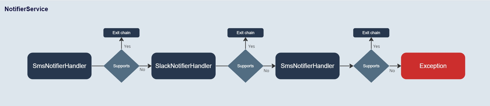
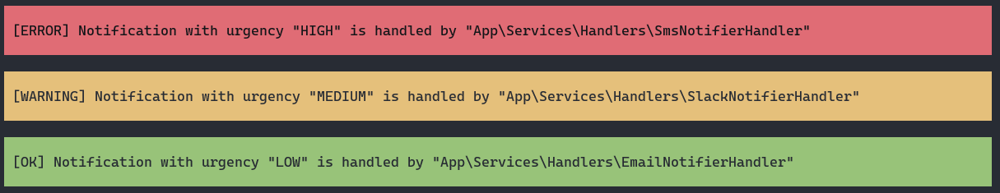

# Chain of Responsibility

The Chain Resolver, or Chain of Responsibility, is a design pattern used in software development that allows an object
to send a command without knowing which object will handle the request. It involves a sequence of handler objects that
are linked together to form a chain. Each handler in the chain has the opportunity to process a request or pass it on to
the next handler in the sequence. This pattern allows for the decoupling of the sender of a request from its receivers,
providing flexibility in assigning responsibilities to various objects and simplifying your system architecture.
Handlers can be added or changed independently without affecting other handlers, making the system easier to manage and
scale.

In this example we will implement chain of responsibility pattern in Symfony to send a notification via different
channels
like email, SMS, and Slack depending on the urgency of the notification, although our approach will slightly differ from
the classic approach, since we will use an array of handlers instead of a traditional linked chain structure.

## Understanding the Architecture

At its core, the NotifierService class orchestrates how notifications are sent out through a variety of handlers. Each
handler is an implementation of the NotifierHandlerInterface, ensuring they all adhere to a standard structure and
behavior. This is where the chain of responsibility pattern comes into play. The NotifierService class doesn't need to
know which handler will process the notification; it simply passes the notification between the handlers in the chain
until one of them decides it can handle the notification, in this case we break from the chain.



Getting all available handlers into the NotifierService class is a bit tricky. We could manually inject each handler
but this is where we use a little of Symfony's magic to automatically inject all the handlers that implement
NotifierHandlerInterface into the construction of NotifierService:

```yaml
_instanceof:
  # Tag all services implementing NotifierHandlerInterface with 'app.notifier-handler'
  App\Services\Handlers\NotifierHandlerInterface:
    tags: [ 'app.notifier-handler' ]

App\Services\NotifierService:
  # Inject all services tagged with 'app.notifier-handler'
  arguments:
    $handlers: !tagged_iterator { tag: 'app.notifier-handler' }
```

Meanwhile, in the NotifierService class, we receive an iterable collection of handlers in the constructor:

```php
class NotifierService
{
    /**
     * Holds an iterable collection of notification handlers.
     * Each handler must implement the NotifierHandlerInterface.
     *
     * @var iterable|NotifierHandlerInterface[]
     */
    private iterable $handlers;

    /**
     * Initializes the service with an array of notification handlers.
     */
    public function __construct(iterable $handlers)
    {
        // Since order of handlers plays a role this would be the place to correct it.
        $this->handlers = $handlers;
    }

    /**
     * Sends a notification through the first supporting handler.
     *
     * Iterates over each handler to check if it can handle the given notification,
     * and if so, uses it to send the notification.
     * If no handler supports the notification, a RuntimeException is thrown.
     
     * @throws \RuntimeException If no handler supports the notification.
     */
    public function send(Notification $notification): DeliveryStatus
    {
        foreach ($this->handlers as $handler) {
            // Check if the current handler supports the notification
            if ($handler->supports($notification) === false) {
                continue; // Skip to the next handler if not supported
            }

            // If supported, send the notification using the current handler and return the status
            try {
                return $handler->send($notification);
            } catch (\Exception $exception) {
                // In case of an exception, log it and continue to the next handler
                continue;
            }
        }

        // Throw an exception if no handlers support the notification
        throw new \RuntimeException('No handler found for notification');
    }
}
```

And each handler decides whether it can handle the notification or in its supports() method:

```php
class EmailNotifierHandler implements NotifierHandlerInterface
{
    /**
     * Determines if this handler should process the notification.
     *
     * This handler only supports notifications with a low urgency level.
     * Checks the urgency of the notification against a predefined low urgency level.
     */
    public function supports(Notification $notification): bool
    {
        // Check if the notification's urgency level is low
        return $notification->getUrgency() === NotificationUrgencyEnum::LOW;
    }

    /**
     * Sends the notification via email.
     *
     * This method is responsible for actually sending the notification and
     * returning the delivery status. Currently, the method needs to be fully implemented.
     */
    public function send(Notification $notification): DeliveryStatus
    {
        // TODO: Implement the actual sending logic for an email notification.

        // For now, returns a new DeliveryStatus indicating the handler class that processed it.
        return new DeliveryStatus($notification, self::class);
    }
}
```

In this example, we have three handlers: EmailNotifierHandler, SmsNotifierHandler, and SlackNotifierHandler. Each
handler is responsible for sending notifications through a specific channel (email, SMS, or Slack). The NotifierService
class receives a notification and iterates over each handler to determine which one can handle the notification. If a
handler supports the notification, it sends the notification through that handler. If no handler supports the
notification, a RuntimeException is thrown, alternatively we could use a default handler instead of exception.

Here are some of the key reasons why this pattern is considered beneficial:

- Dynamic Handling: Regardless of the number of handlers or the order in which they are added, the NotifierService class
  remains
  unchanged.
- Decoupling of Sender and Receiver: The pattern allows the sender of a request to issue it without knowing which object
  will handle it. This separation of concerns means that the sender and receiver are decoupled, which enhances the
  modularity of the application and makes it easier to modify or extend.
- Failure Handling: It naturally accommodates a failover mechanism; if one handler fails to process the request
  adequately, it can be passed along to subsequent handlers that might take corrective action or provide fallback
  processing.
- Simplification of Object Interconnections: Instead of maintaining a dedicated handler for each type of request within
  a single object, requests can traverse through a chain of potential handlers. This setup simplifies the
  interconnections between objects, reducing dependencies and complexities in object configuration.
- Improved Scalability: The Chain of Responsibility pattern can help manage growing complexity in systems where numerous
  objects might handle a request. As systems grow and evolve, maintaining them becomes more manageable by simply
  adjusting the chain rather than reengineering the relationships between objects.
  
And its drawbacks:
- Performance Concerns: As requests might pass through multiple handlers before being processed, the chain can introduce
  additional overhead and delay in request processing. This can be particularly problematic in performance-sensitive
  applications where every millisecond counts.
- Debugging Complexity: Tracing which part of the chain a request is processed in or where it fails can be challenging,
  especially with a long chain of handlers. This complexity can make debugging more difficult and time-consuming.
- Overhead of Maintaining the Chain: Managing the chain can become cumbersome as it grows. Adding, removing, or changing
  handlers needs careful consideration to ensure that the chain's integrity and the order of processing are maintained.
- Suboptimal Design Choice for Simple Scenarios: For applications with simple or static request handling needs,
  employing a chain of responsibility might be an overkill. Simpler and more direct forms of request handling could be
  more appropriate and efficient.

Running this proof of concept will require you to have a Symfony environment set up.

```bash
git clone git@github.com/ivanstan/chain-of-responsibility.git
```

```bash
cd chain-of-responsibility && composer install
```

```bash
bin/console notifier:send
```

The output should look like this, describing which handler processed the notification:


